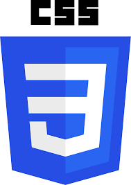
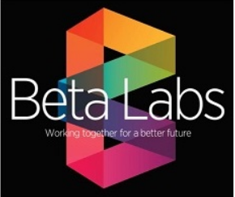

# [TravelYaari](https://shsarv.github.io/TravelYaari/)  

  

 
This Project is Live at -----> https://shsarv.github.io/TravelYaari/

#### [Mentor: Pankaj Kapoor](https://github.com/pankkap)

This Repository contain Fullstack mini project using Front end technologies.

### Overview  
  
   This project is based on how an effective travel website will make us feel. It is based on a  travelling  website  with  front-end only  that  will  activate  the travelling bug with  vibrant  imagery.This  website  contains highlights  of  some  important  places  along with  high  quality photography.
  
### Motivation  
 
 People all over the world are fond of travel and tourism.People often find it difficult to search for the best places .To address the issue,we adopt the travelling website which will offer best places among others.
 
### Objective 
  
  
  The main objective of the projectis to create a website using  front-end  technologies to  continuously  provide enjoyable quality excursions/trips on time and on budget.It will also develop enthusiastically satisfied customers all of the time. 
  
  
### Project Flow 
  
  
  
  - This project was divided in to Five phases :-
  
#### phase -1 (15 Jul 2020 - 18 Jul 2020): 

- Group Meeting on 15 July
  
      * Motive Declaration and resource gathering
      * Analyzing Different travelling Blogs
      * Understanding working of a tour and travel Website.

#### phase-2 (18 Jul 2020 - 10 Oct 2020):

- Group Meeting on 19 July.

      * Basic Skelton making of the project
      * index page designing
      * user validation and access generation (login signup)
      * designing pages for authorised and non authorised user.

#### plase -3 (10 Oct 2020 - 22 November 2020):

- Group Meeting on 10 Oct.

      * Creating all the type of places.
      * creating cities page
      * Styling each pages.
      * linking videolink to each destination
      * add overlay to each place for more details.

#### phase 4 (22 Nov 2020 - 28 Nov 2020):

- Group Meeting on 21 Nov.

      * Adding setting service to the user.
      * adding details about us.
      * adding contact page to reach us and booking service.
      * linking each page and making final touch up to each page

#### phase 5 (2 Dec 2020):

      * Deployment of fully working website to github pages.
 
 
 

 
 
### Technologies  
  
The technologies that we have used in making this project are :
  
   <table>
  <tr>
    <td align="center">
  <a href="https://en.wikipedia.org/wiki/HTML"> <b>HTML5</b></a></td>
   <td align="center">
  <a href="https://en.wikipedia.org/wiki/Cascading_Style_Sheets"> <b>CSS3</b></a></td>
    <td align="center">
  <a href="https://en.wikipedia.org/wiki/Bootstrap_(front-end_framework)"> <b>Bootstrap</b></a></td>
   <td align="center">
  <a href="https://en.wikipedia.org/wiki/JavaScript"> <b>JAVASCRIPT</b></a></td>
    <td align="center">
  <a href="https://jquery.com/"> <b>JQuery</b></a></td>
 </tr>
 </table>
 
 
   
  
  
### Contributors 
  
  
  <table>
  <tr>
    <td align="center"><a href="https://github.com/shsarv"> <b>Sarvesh Kumar Sharma</b></a> <a href="#" title="Content">🖋</a> <a href="https://github.com/shsarv/TravelYaari/commits?author=shsarv" title="Documentation">📖</a><a href="https://github.com/shsarv/TravelYaari/commits?author=shsarv" title="Code">💻</a></td>
   <td align="center"><a href="https://github.com/satyamjha1710"> <b>Satyam Kumar jha</b></a> <a href="https://github.com/shsarv/TravelYaari/commits?author=satyamjha1710" title="Code">💻</a></td>
    <td align="center"><a href="https://github.com/sachi42"> <b>Sachi Tripathi</b></a> <a href="https://github.com/shsarv/TravelYaari/commits?author=sachi42" title="Code">💻</a></td> 
   <tr>
    <table>
     
   
   
  
### License    
  
    * Apache-2.0 License copyright &copy; 2020 Sarvesh Kumar Sharma
  
   
  
      
### References   
  
  <table>
  <tr>
    <td align="center">
  <a href="https://github.com/pankkap"> <b>Pankaj Kapoor</b></a></td>
   <td align="center">
  <a href="https://www.beta-labs.in/"> <b>BETA-LABS</b></a></td>
 </tr>
 </table>
  
  
