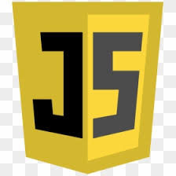

# Travel-Yaari

This Repo contains Fullstack mini project using Front end technologies and  
This Project is Live at -----> https://shsarv.github.io/TravelYaari/

  ### Overview
  
   This project is based on how an effective travel website will make us feel. It is based on a  travelling  website  with  front-end only  that  will  activate  the travelling bug with  vibrant  imagery.This  website  contains highlights  of  some  important  places  along with  high  quality photography.
  
  ### Motivation
  
  People all over the world are fond of travel and tourism.People often find it difficult to search for the best places .To address the issue,we adopt the travelling website which will offer best places among others.
 
  ### Objective
  
  
  The main objective of the projectis to create a website using  front-end  technologies to  continuously  provide enjoyable quality excursions/trips on time and on budget.It will also develop enthusiastically satisfied customers all of the time. 
 
  ### Technologies Used
  
  * The technologies that we have used in making this project are :
  
   <table>
  <tr>
    <td align="center">
  <a href="https://en.wikipedia.org/wiki/HTML"> <b>HTML5</b></a></td>
   <td align="center">
  <a href="https://en.wikipedia.org/wiki/Cascading_Style_Sheets"> <b>CSS3</b></a></td>
    <td align="center">
  <a href="https://en.wikipedia.org/wiki/Bootstrap_(front-end_framework)"> <b>Bootstrap</b></a></td>
   <td align="center">
  <a href="https://en.wikipedia.org/wiki/JavaScript"> <b>JAVASCRIPT</b></a></td>
 </tr>
 </table>
 
  
  ### Contributors
  
  
   <table>
  <tr>
    <td align="center"><a href="https://github.com/shsarv"> <b>Sarvesh Kumar Sharma</b></a></td>
   <td align="center"><a href="https://github.com/sachi42"> <b>Sachi Tripathi</b></a></td>
   <td align="center"><a href="https://github.com/satyamjha1710"> <b>Satyam Kumar jha</b></a></td>
   
   <tr>
    <table>
   
  
  ### License
  
  * Apache-2.0 License copyright &copy; 2020 Sarvesh Kumar Sharma
      
  ### References
  
  <table>
  <tr>
    <td align="center">
  <a href="https://github.com/pankkap"> <b>Pankaj Kapoor</b></a></td>
   <td align="center">
  <a href="https://www.beta-labs.in/"> <b>BETA-LABS</b></a></td>
 </tr>
 </table>
  
  
